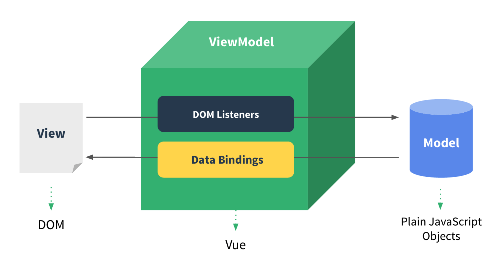

# Vue

## Vue 中的 MVVM



Vue 是以数据为驱动的，Vue 自身将 DOM 和数据进行绑定，一旦创建绑定，DOM 和数据将保持同步，每当数据发生变化，DOM 会跟着变化。

DOM Listeners 和 Data Bindings 是实现双向绑定的关键。

DOM Listeners 监听页面所有 View 层 DOM 元素的变化，当发生变化，Model 层的数据随之变化

Data Bindings 监听 Model 层的数据，当数据发生变化，View 层的 DOM 元素随之变化

## 生命周期


### 父子组件生命周期顺序

#### 创建挂载

父 beforeCreate -> 父 created -> 父 beforeMount -> 子 beforeCreate -> 子 created -> 子 beforeMount -> 子 mounted -> 父 mounted

#### 更新

父 beforeUpdate -> 子 beforeUpdate -> 子 update -> 父 update

#### 销毁

父 beforeDestory -> 子 beforeDestory -> 子 destoryed -> 父 destoryed

### 每个钩子中可以进行的操作

**created**: 拿到 data 和 methods

**mounted**: 操作 DOM

## 异步请求放在 created 还是 mounted 中

生命周期钩子函数中的异步会放入事件队列，而不会在这个钩子函数中执行。也就是说你在 created 和 mounted 中请求数据是一样的，都不会立即更新数据，所以不会导致虚拟 DOM 重新加载，也不影响页面中静态的部分加载。生命周期钩子函数中的异步赋值，vue 会在一遍流程走完之后执行 updated。另外，给数据赋值然后更新 DOM 也是异步的，侦听到数据变化，Vue 将开启一个队列，并缓冲在同一事件循环中发生的所有数据变更，去掉重复赋值然后更新。

所以在 created 中和 mounted 中请求数据，数据的更新时间是一样的，在 created 中发起请求，可以更早的请求到数据。并且使用服务端渲染 SSR 的时候， mounted 钩子不会加载。

参考：

-   [https://juejin.im/post/5d8c6a97e51d45782c23fa69#heading-3](https://juejin.im/post/5d8c6a97e51d45782c23fa69#heading-3)

## 长列表性能优化

Vue 会通过 Object.defineProperty 对数据进行劫持，来实现视图响应数据的变化，然而有些时候我们的组件就是纯粹的数据展示，不会有任何改变，我们就不需要 Vue 来劫持我们的数据，在大量数据展示的情况下，这能够很明显的减少组件初始化的时间，可以通过 Object.freeze 方法来冻结一个对象，一旦被冻结的对象就再也不能被修改了。

```js
export default {
    data: () => ({ users: {} }),
    async created() {
        const users = await axios.get('/api/users');
        this.users = Object.freeze(users);
    }
};
```

另外需要说明的是，这里只是冻结了 users 的值，引用不会被冻结，当我们需要 reactive 数据的时候，我们可以重新给 users 赋值。

```js
export default {
    data: () => ({
        users: {}
    }),
    async created() {
        const users = await axios.get('/api/users');
        this.users = Object.freeze(users);
    },
    methods: {
        change() {
            // 改变值不会触发视图响应
            this.data.users[0] = newValue;
            // 改变引用依然会触发视图响应
            this.data.users = newArray;
        }
    }
};
```

参考：

-   [7 个有用的 Vue 开发技巧](https://mp.weixin.qq.com/s/rbkrg-_vINngG0dvHtZFbg)

## computed 中的 getter 和 setter

```js
computed: {
    fullName: {
        // getter
        get: function () {
        return this.firstName + ' ' + this.lastName
        },
        // setter
        set: function (newValue) {
            var names = newValue.split(' ')
            this.firstName = names[0]
            this.lastName = names[names.length - 1]
        }
    }
}
```

## 父子组件传值方式

### props/\$emit

### vuex

### sessionStorage、localStorage

### eventBus

在一个组件内通过 $on 一个事件, 在一些操作下 $emit 事件

```js
mounted() {
    this.$on('aaa', data => {
        console.log(data);
    });
},
methods: {
    trigger() {
        this.$emit('aaa', 'bbb');
    }
}
```

上面的 eventBus 是局部的, 只能在这个组件内用

全局的 eventBus 可以简单理解为在一个文件创建一个新的 Vue 实例然后暴露出去, 使用的时候 import 这个模块进来即可

#### eventBus 的问题

切换路由, 重新渲染，事件触发时会被重复执行多次，原因是因为在组件被 destory 时候, eventBus.\$on 的事件是不会被销毁, 组件的每次重新 render, 事件就会叠加注册, 而 eventBus 是全局的，它不会随着你页面切换而重新执行生命周期。

解决方法

在 eventBus.on 的组件中,在 beforeDestroy 或者 destoryed 生命周期中 off 事件

参考：

-   [https://juejin.im/post/5d358280e51d4556bc06704d](https://juejin.im/post/5d358280e51d4556bc06704d)

### $parent/$children/ref

### provide/inject

祖先组件中通过 provide 来提供变量, 然后再子孙后代组件中通过 inject 来注入变量，不论组件层次有多深

### \$attrs

包含了父作用域中不作为 prop 被识别 (且获取) 的特性绑定 (class 和 style 除外)

例如 `<child :aaa="123" :bbb="234" />`，子组件 child 使用 props 进行接收，未被子组件使用 props 接收的可以使用 \$attrs 拿到传递的值

如果 child 的 props 中只接收了 aaa，那么 \$attrs 的值就是 {bbb: '234'}

同时如果在孙子组件中引入 child 组件，并使用 v-bind 将 \$attrs 绑定在组件上 `<grandson v-bind="$attrs" />` 即可在 grandson 中使用 props 或 \$attrs 接收，按此规律可以一直传递

未被组件使用的变量将显示在 html 结构中，例如：


在子组件的选项中设置 `inheritAttrs: false` 可将其隐藏（注意：将 inheritAttrs 设为 false 并不会影响 \$attrs 的使用）

### \$listeners

$attrs 将父组件的值传给子组件，$listeners 是将方法从父组件传给子组件

包含了父作用域中的 (不含 .native 修饰器的) v-on 事件监听器，它可以通过 `v-on="$listeners"` 传入内部组件

例如：

```js
// father
<child :aaa="123" :bbb="234" @aaa="aaa" />

methods: {
    aaa(data) {
        console.log(data);
    }
}

// child
<grandson v-on="$listeners" />

// grandson
methods: {
    click(data) {
        this.$emit('aaa', 1234)
    }
}
```

### Vue.observable

让一个对象可响应。Vue 内部会用它来处理 data 函数返回的对象

返回的对象可以直接用于渲染函数和计算属性内，并且会在发生改变时触发相应的更新。也可以作为最小化的跨组件状态存储器，用于简单的场景

```js
import Vue from 'vue';

export const store = Vue.observable({ count: 0 });

export const mutations = {
    setCount(count) {
        store.count = count;
    }
};
```

然后在组件里面引入这个 store.js，在组件里面使用引入的数据和方法

```vue
<template>
    <div>
        <p>count: {{ count }}</p>

        <button @click="setCount(count + 1)">+1</button>

        <button @click="setCount(count - 1)">-1</button>
    </div>
</template>

<script>
import { store, mutations } from './store';

export default {
    computed: {
        count() {
            return store.count;
        }
    },
    methods: {
        setCount: mutations.setCount
    }
};
</script>
```

参考：

-   [你不知道的 vue 组件传值方式](https://juejin.im/post/5dafc84a6fb9a04de04d98d5)

## 定时器清除

在 beforeDestroy 中清除

```js
export default {
    mounted() {
        this.timer = setInterval(() => {
            console.log(1);
        }, 1000);
    },
    beforeDestroy() {
        clearInterval(this.timer);
    }
};
```

但是需要保存变量 timer

推荐方法：

```js
export default {
    mounted() {
        const timer = setInterval(() => {
            console.log(1);
        }, 1000);
        this.$once('hook:beforeDestory', () => {
            clearInterval(timer);
        });
    }
};
```
